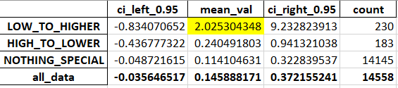
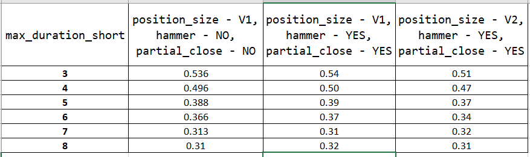

# python-backtesting-template
Trading strategy template that uses Python `backtesting` library. It lets you focus on improving your price forecasts and reduces the time and effort spent on auxiliary tasks.

# Understanding the Benefits of This Repo

Just like with the original Python `backtesting` package, you can obtain and use `stats`, `trades`, and interactive charts in HTML files. In addition, this repository solves many problems that the `backtesting` library does not solve.

1. You can easily run backtests of your strategy for several (or several dozen) tickers simultaneously. The results of these backtests are combined and saved in the `output.xlsx` file. For details, explore files in the `strategy` folder.

2. The `run_backtest_for_ticker` function returns not only `stats` and `trades` but also `last_day_result` dict. It allows you to send notifications if the trading signal is detected. For details, see the `utils/strategy_exec/last_day.py` file and `next` function.

3. The system updates trailing stop-loss daily using the Average True Range (ATR) multiplied by 2.5. If a volatility outbreak (`tr_delta` high value) is detected, the stop loss is tightened. You can customize this behavior in `utils/strategy_exec/stop_loss.py` file.

4. If it's possible to close half of the active position and make the remaining half risk-free, the system will do so. See the file `utils/strategy_exec/partial_close.py` for details. You can easily change or disable this behavior if you wish.

5. In addition to partial closures, the system handles many other special situations. For details, see the `utils/strategy_exec/special_situations.py` file. You are encouraged to modify the list of special situations, change the order of their processing, and add your custom special situations.

6. You can set the maximum duration for long and short trades. See the `process_max_duration` function for details.

7. You can analyze trades in many different ways. The system adds tags to many trades that explain their fate. Each trade can contain several tags. For details, explore the `add_tag_to_trades_and_close_position` function code and where it is called. See also the functions `add_feature_to_trades` and `get_stat_and_trades_for_ticker`. 

8. You can optimize different parameters of your strategy. See the variable `strategy_params`, its filling in `run_strategy_main.py` and its usage in the `get_desired_current_position_size` function. 

# Workflow Overview

Like the original `backtesting` package, most work happens within the `next` function of the `Strategy` you create. The system calls this function each day of your OHLC data, starting from the first day. 

Here’s what happens inside this function in the `run_backtest_for_ticker.py` file:
1. Update the trailing stop-losses for all open trades.
2. If we have open trades, check for special situations. (See more details on special situations in the following section.)
3. If no special situations are found, calculate the desired position size. If it differs significantly from the current size, buy or sell additional shares.
4. If today is the last day in the data, the system calls the `create_last_day_results` function, which populates and returns the `last_day_result` dictionary.

The system calls the `get_desired_current_position_size` function to determine the current and desired position sizes. If the desired position size is 0, the system closes all open trades. If it's `None`, no calculation of the difference between the current and desired position sizes is needed, and no buy or sell orders are placed with the broker.

After the finish of the backtest, the `get_stat_and_trades_for_ticker` function returns the `last_day_result` dictionary together with other results. This dictionary is then passed to the `process_last_day_res` function. This function is intended to send you notifications when specific conditions are met. However, it has not been implemented yet. 

It is assumed that you will not change the code of the `next` function. The main goal of this repository is to free you from the effort of writing and modifying it. Instead, you can focus on coding the rules for determining the desired position size in the `get_desired_current_position_size` function. Also, try to change the list of special situations to check within the `process_special_situations` function. Additionally, you should implement one or more functions to create your features.

# Quick Start

The system currently uses [Alpha Vantage](https://www.alphavantage.co/) as its main source of OHLC data. If you want to change it, modify the `import_ohlc_daily` function. 

First of all, you need to register on the Alpha Vantage site to receive a free API key. Write this key to your environment variables. At the start of the run, the system will retrieve it `ALPHA_VANTAGE_API_KEY = os.environ.get("alpha_vantage_key")` and use it. 

To avoid requesting data from Alpha Vantage every time, the system saves copies of the data as Excel files in the `/tmp/` folder. For example, `single_SPY.xlsx`. To make the system access Alpha Vantage again, you need to manually delete these files. You can modify the destination folder in the `constants.py` file.

Once you have received the API key from Alpha Vantage and given the system access to it, follow these steps.

1. Create some forecast in the `forecast` folder. See `forecast_bb.py` file for example.
2. Add its `get_forecast_***` function to the `utils/prepare_df.py` file.
3. Specify your forecast in the `init` function of the trading strategy in `strategy/run_backtest_for_ticker.py` file.
4. Code the rules for determining the desired position size in the `get_desired_current_position_size` function in `get_position_size_main.py` file.
5. Review and, if desired, change the `tickers_all` list in the `constants.py` file.
6. Run the `run_strategy_main.py` file. When the script finishes running, view the `output.xlsx` file, as well as logs in the `app_run.log` file.

Note 1. The file `output.xlsx` is created only if the number of tickers is more than one.

Note 2. If you wish, you can use several different forecasts at the same time, as well as additional features for filtering trades. In real life, you will most likely do so.

Invention of forecasts and rules for determining the desired position size are the steps where you create value.

# Output.xlsx File Overview and Explanations

Your `output.xlsx`file may look like the following:

If you are a trader, you probably understand the meaning of its rows. The only row that requires explanation is `SQN_modified`. 

System Quality Number (SQN) is a popular indicator of the trading system's quality developed by Dr. Van Tharp. Its classic formula has a drawback: it tends to produce overly optimistic results when analyzing more than 100 trades, particularly when the number of trades exceeds 150-200. 

`SQN_modified` is devoid of this drawback. It is simply the average of trade profits divided by the standard deviation of profits. A trading system is considered not bad if its `SQN_modified` has a positive value of at least 0.1. Systems whose `SQN_modified` value exceeds 0.2 are deemed decent or even good. By looking through the `output.xlsx` file, you can easily calculate the average  `SQN_modified` for all tickers.

# Implementing Your Custom Features

The purpose of this repository, like the original `backtesting` package, is to test the effectiveness of your custom features as trading signals. When we talk about creating features, we refer to adding one or more columns to the OHLC data based on rules. You can store functions that accomplish this in the `features` folder.

You also need a function that calls the feature-creation functions. Pass this function as the `add_features_forecasts_func` parameter to the `get_stat_and_trades_for_ticker` function. It is advisable to place this function in the `utils/prepare_df.py` file to avoid confusion.

Although everything written above may seem complicated, you will quickly understand it after reviewing the examples in the specified folders and files.

# Managing Special Situations

Special situations include scenarios such as the maximum trade duration expiring, a volatility spike occurring, or the discovery of a bullish or bearish candle. If the system detects at least one of these situations, it should close the position immediately.

You can access the most recent trade using this code: `last_trade = strategy.closed_trades[-1]`. Each trade has a `tag` parameter. When the system detects a special situation, it adds a tag to all trades before closing them, allowing you to identify the context later. The `add_tag_to_trades_and_close_position` function handles this task. For examples of its use, refer to the `utils/special_situations.py` file.

You can parse the tag of the last trade and take different actions based on its content. For example, when some special situation is detected, it may be wise to wait a few days before opening new long or short positions.

You can specify which special situations to check and their order within the `process_special_situations` function. Additionally, you can add your custom special situations to the `utils/special_situations.py` file. The profitability of trades largely depends on the rules you establish for handling special situations.

## Understanding the Partial Close Special Situation

The Partial Close Special Situation occurs when there is an opportunity to close part of a position—such as half or one-third—at a profit. It allows you to make the remaining portion of the position risk-free. The system processes the Partial Close special situation alongside other special situations. However, when it occurs, the position is only partially closed, not completely closed.

Handling the Partial Close special situation is a powerful strategy for enhancing the profitability of your trading systems. You can turn it off within the `process_special_situations` function code, but it is almost always advisable to leave it enabled.

Take the time to study the `process_partial_close` and `_process_partial_close` functions closely. In the line `_, size_to_close = math.modf(abs(strategy.position.size) / 2)`, you can specify the percentage of the position to close. By default, it is set to close half of the position. You can try to adjust it to one-third instead.

# Optimization of Strategy Parameters

You can determine the best values for one or more numerical parameters in your trading strategy. These are the parameters the `get_desired_current_position_size` function uses to calculate the desired position size.

A script `optimize_params.py` can help you in finding the optimal parameter values. After it runs, you'll have a file `parameter_values.xlsx` with the results. It will look like this.

It's a good sign when the charts of backtest results depending on parameter values resemble Gaussian curves. Little deviations from the optimal parameter value should ​​only cause slight deterioration in backtest results. If the backtest results fluctuate wildly and chaotically, something went wrong.

# Analyzing Close-Close Returns

This repository could assist you in analyzing the likely direction of stock prices over the next few days. Some days, you can predict it with a fair amount of confidence based on today's value of some features. These features may be discrete or continuous. The script `run_analysis.py` demonstrates how to do it. It runs the functions that are in the `analysis/fwd_returns` folder.

## Discrete Feature Example

As a tutorial example of using a discrete feature, see `bb_cooling`. It is a rudimentary indicator suggesting that overbought or oversold conditions are beginning to stabilize. See details in the function `add_bb_cooling_to_ohlc`. It adds this feature as a column to the OHLC data.

The `analyze_fwd_ret_by_bb_cooling` function performs the analysis and saves the results in an Excel file. The `run_analysis.py` script calls this function for stocks, precious metals, and commodities.

Getting long commodities when oversold conditions stabilize (`LOW_TO_HIGHER` group) could be a promising strategy. 

Theoretically, taking a short position in commodities when market excitement starts to cool should be profitable. This situation is indicated by stabilizing overbought conditions, the `HIGH_TO_LOWER` group. However, the current version of the `bb_cooling` feature does not support this assumption. 

Please note that the `bb_cooling` feature is rudimentary. You would better not use it for real-world trading without substantial enhancements.

## Continuous Feature Example

The `add_bb_forecast` function adds a `forecast_bb` column to the data. This column serves as a rudimentary trend strength indicator. Typically, folks plot Bollinger Bands where the absolute value of this indicator exceeds 2.0 or 2.2. A price crossing above the upper Bollinger Band signals overbought conditions. Also, a price crossing below the lower Bollinger Band signals oversold conditions.

The `analyze_fwd_ret_by_bb_group` function demonstrates the analysis of the continuous feature `forecast_bb`. Initially, it adds a new column to the data, labeling each row according to the group the current `forecast_bb` value falls into. The function `add_feature_group_col_to_df` is responsible for it. This function has some intricacies worth examining closely. 

You can easily customize the splitting of continuous features into groups and the ordering of those groups. For each feature value, the feature's custom function `get_group_label_XXX` returns its label. The new column `new_col_name` stores this label.

After adding group labels, the main function `analyze_fwd_ret_by_bb_group` calls `analyze_values_by_group` function to calculate average returns over the next few days for each group, along with their confidence interval. The results for all groups are then saved to an Excel file in a format that is easy to review and compare.

In addition to splitting into groups and analyzing these groups, you can perform a linear regression of the `ret_{NUM_DAYS_FWD_RETURN}` column against the continuous feature column. Information on how to conduct a linear regression and interpret its results is readily available elsewhere.

# A Real-Life Example

I hope you find the example below helpful and inspiring. To do something similar, use the `run_strategy_main.py` or `optimize_params.py` file.

I recently tested a feature represented in the OHLC DataFrame as a Boolean column. When its value was occasionally True, it signaled the system to open a short position. The system would hold this position until either the `max_trade_duration_short` expired or some special situation triggered an earlier closure. Also, there are certain conditions where it may be wise to close the position early, even if no special situation has been triggered and the `max_trade_duration_short` has not yet expired.

The primary task was to test various values of the `max_trade_duration_short` variable. Regarding special situations, I determined that `take_profit` and `volatility_spike` were irrelevant for this feature, so I commented them out in the `process_special_situations` function. 

To test the custom conditions for closing a position early, I created and ran two variations of the `get_desired_current_position_size` function, referred to as **position_size - V1** and **V2** in the table below. Alternatively, I could test these conditions by adding a custom special situation.

In addition to testing different `max_trade_duration_short` values and custom conditions for early position closing, I also evaluated whether the system should handle the `hammer` and `partial_close` special situations. I have easily accomplished this by commenting out specific sections of the `process_special_situations` function code.

For each variation of the parameters mentioned above, the system conducted backtests on 11 different stock and ETF tickers. The resulting data shows the average `SQN_modified` value across all tickers. The table below presents these results partially.

The longer the system keeps short positions open, the more volatile the results become. It leads to a decrease in the average `SQN_modified` value. The other parameters have little impact on the outcome. However, it looks beneficial to handle the `hammer` and `partial_close` special situations and to use the `get_desired_current_position_size V1` function.

# Conclusion

This repository contains a substantial amount of Python code. Unfortunately, its structure is quite complex. Due to limitations in the original `backtesting` package, simplifying it isn't feasible. Learning the available features and understanding the code's intricacies will take time and effort, but I believe it will be a worthwhile investment for you.