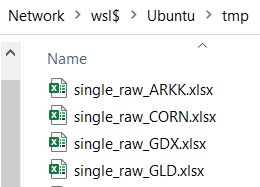
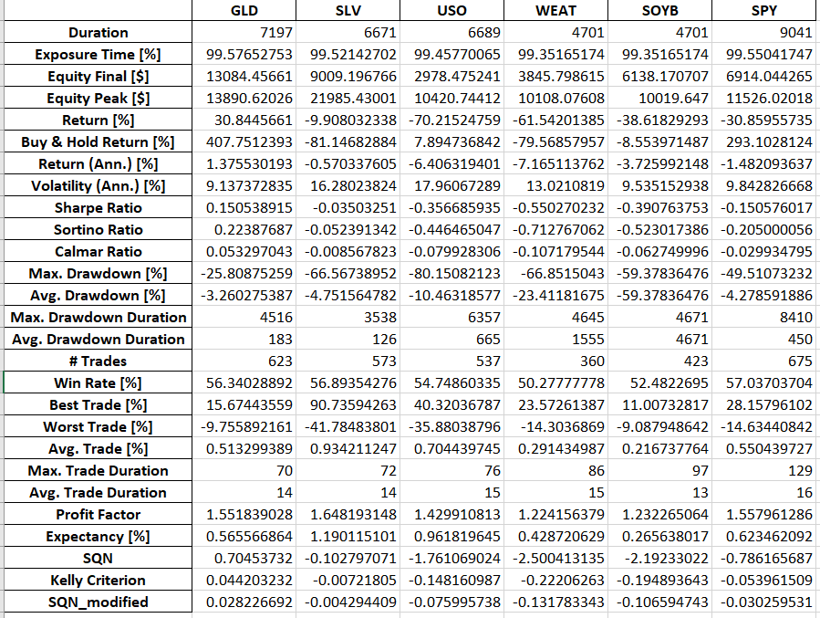
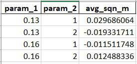

# python-backtesting-template
Trading strategy template that uses Python `backtesting` library. It lets you focus on improving your price forecasts and reduces the time and effort spent on auxiliary tasks.

# Understanding the Benefits of This Repo

Just like with the original Python `backtesting` package, you can obtain and use `stats`, `trades`, and interactive charts in HTML files. In addition, this repository solves many problems that the `backtesting` library does not solve.

1. You can easily run backtests of your strategy for several (or several dozen) tickers simultaneously. The results of these backtests are combined and saved in the `output.xlsx` file. For details, explore files in the `strategy` folder.

2. The `run_backtest_for_ticker` function returns not only `stats` and `trades` but also `last_day_result` dict. It allows you to send notifications if the trading signal is detected. For details, see the `utils/strategy_exec/last_day.py` file and `next` function.

3. The system updates trailing stop-loss daily using the Average True Range (ATR) multiplied by 2.5. If a volatility outbreak (`tr_delta` high value) is detected, the stop loss is tightened. You can customize this behavior in `utils/strategy_exec/sl_pt.py` file.

4. If it's possible to close half of the active position and make the remaining half risk-free, the system will do so. See the file `utils/strategy_exec/partial_close.py` for details. You can easily change or disable this behavior if you wish.

5. In addition to partial closures, the system handles many other special situations. For details, see the `utils/strategy_exec/special_situations.py` file. You are encouraged to modify the list of special situations, change the order of their processing, and add your custom special situations.

6. You can set the maximum duration for long and/or short trades. See the `process_max_duration` function for details.

7. You can set the profit target in percent for long and/or short trades. See the functions `check_set_profit_targets_long_trades` and `check_set_profit_targets_short_trades` for details.

8. You can analyze trades in many different ways. The system adds tags to many trades that explain their fate. Each trade can contain several tags. For details, explore the `add_tag_to_trades_and_close_position` function code and where it is called. See also the functions `add_feature_to_trades` and `get_stat_and_trades_for_ticker`. 

9. You can quickly test your hypotheses before setting up and running advanced backtests. For detailed instructions on this, see below. The file `run_fwd_return_analysis.py` provides a working example.

10. You can easily optimize every parameter of your trading strategy, including stop-losses, profit targets, maximum trade duration, and more. For detailed instructions on this, see below. The file `run_strategy_main_optimize.py` provides a working example. 

You create value by developing trading signals and rules for calculating the desired position size. This repository allows you to focus on these tasks while minimizing the time and effort spent on miscellaneous concomitant problems. 

Although everything written below may seem complicated, you will quickly understand it after reviewing the examples in the specified folders and files.

# Suggested Workflow

Let's assume you have a trading signal in mind and want to test whether it is worthwhile for real-world trading.

First, you create the necessary derived columns and one or more features based on them in the `\customizable\add_features.py` file. Derived columns might include metrics such as trend slope, moving average, average true range (ATR), RSI, and others.

The next step is to run a quick analysis to see how returns in the following days relate to today's values of your features. The file `run_fwd_return_analysis.py` shows how to do it, with detailed explanations in the code. 

If your feature is continuous, you can split it into groups and run the `analyze_values_by_group` function. This step is optional. The function `_get_ma_200_relation_label` is an example of partitioning into groups and assigning labels to groups.

Also, you could regress the future returns on your continuous feature, though there isn’t an example of such a regression in the `run_fwd_return_analysis.py` file yet.

If the preliminary analysis suggests that your trading signal warrants further testing, you can set up backtests.

It includes the following steps:

1. Review the code of the `next` function and other content of the `\strategy\run_backtest_for_ticker.py` file. Check out the input parameters of the `Backtest` class initialization.

2. List the parameters your trading strategy will require within the `StrategyParams` class. 

3. Define the rules for calculating the desired position size and code them within the `get_desired_current_position_size` function.

4. Review the code of the `process_special_situations` function. You might want to comment out certain special situations, add your own, or change the order in which the system processes them.

5. Review the code of the `update_stop_losses` function. Note the `stop_loss_default_atr_multiplier` parameter and its value. You may want to change the `update_stop_losses` function or cancel its daily calls inside the strategy's `next` function.

6. See the `process_partial_close` function. You may try to cancel its daily calls or change the `portion_to_close=0.5` value to, say, 0.33.

After completing the steps above, run backtests on the tickers you are interested in. Use the `run_strategy_main_simple.py` file as a template. 

Once you've conducted the backtests and reviewed the `output.xlsx` file, attempt to optimize your strategy parameters. The code and explanations in the `run_strategy_main_optimize.py` file will assist you in this process.

Please note that the file `output.xlsx` is created only if the number of tickers is more than one.

# How Backtests Run

Like the original `backtesting` package, most work happens within the `next` function of the `Strategy` you create. The system calls this function each day of your OHLC data, starting from the first day. 

Here’s what happens inside this function in the `run_backtest_for_ticker.py` file:
1. Update the trailing stop-losses for all open trades.
2. If we have open trades, check for special situations. (See more details on special situations in the following section.)
3. If no special situations are found, calculate the desired position size. If it differs significantly from the current size, buy or sell shares.
4. If today is the last day in the data, the system calls the `create_last_day_results` function, which populates and returns the `last_day_result` dictionary.

## Calculating Desired Position Size and Processing Results

The system calls the `get_desired_current_position_size` function to determine the current and desired position sizes. 

If the resulting desired position size is 0, the system closes all open trades. 

If it is `None`, no buy or sell orders are placed with the broker.

Otherwise, the system calculates the difference between the current and desired position size. If this difference is too large, an order is created to buy or sell the corresponding number of shares.

## Tracking Real-Time Trading Signals in Data

After the finish of the backtest, the `get_stat_and_trades_for_ticker` function returns the `last_day_result` dictionary together with other results. This dictionary is then passed to the `process_last_day_res` function. This function is intended to send you notifications when specific conditions are met. However, it has not been implemented yet. 

It is assumed that you will not change the code of the `next` function. The main goal of this repository is to free you from the effort of writing and modifying it. Instead, you can focus on coding the rules for determining the desired position size in the `get_desired_current_position_size` function.

# External Data Providers

The system currently uses [Alpha Vantage](https://www.alphavantage.co/) as its main source of OHLC data. If you encounter issues with this provider, you can switch to Yahoo Finance instead. 

Please see internals of the functions `import_alpha_vantage_daily` and `import_yahoo_daily`. One of these functions must be passed as `import_ohlc_func parameter` when creating an instance of the `TickersData` class. By default, `import_alpha_vantage_daily` is passed.

To use Alpha Vantage, register on their website to get a free API key, and save it in the `.env` file as `alpha_vantage_key=MY_A_V_API_KEY`. In the `\utils\import_data.py` file, there’s a line `ALPHA_VANTAGE_API_KEY = os.environ.get("alpha_vantage_key")`. Ensure that your code properly retrieves the API key from the `.env` file.

No API key is required for requests to Yahoo Finance. However, this provider only supplies daily OHLC data covering the last few years. Alpha Vantage, on the other hand, provides data over a longer historical period.

# Local Data Caching with Excel Files

The system saves local copies of data in Excel files. It stores “raw” data and also data with added derivative columns and features. 

Template for naming a file with raw data: `single_raw_TICKER.xlsx`. Template for naming a file with data and added columns: `single_with_features_TICKER.xlsx`. 

All these files are stored in the `\tmp\` folder by default. You can easily change the destination folder and naming templates in the `constants.py` file.



The class `TickersData` carries the work with Excel cache files. This class is described in detail below.

# Centralized OHLC Data Repository

The `TickersData` class performs the following tasks:
1. It retrieves "raw" daily OHLC data for each ticker from an external provider.
2. It calls the function you created in the `\customizable\add_features.py` file to add derived columns and features.
3. It generates and stores a dictionary with tickers as keys and Pandas DataFrames as values.
4. It saves local Excel cache files, as described above.

If the class instance finds existing local `.xlsx` cache files, it reads that data instead of making requests to the external provider. If you want it to retrieve fresh OHLC data from the provider, delete the `single_raw_TICKER.xlsx` cache files manually.

An instance of the `TickersData` class acts as a centralized repository for OHLC data. All functions that require OHLC data use this instance to operate. 

For example,

``` python
def run_all_tickers(
    tickers_data: TickersData,
    strategy_params: StrategyParams,
    tickers: List[str] = tickers_all,
) -> float:
```

The class includes a `get_data` function that returns a ticker's DataFrame. It contains OHLC data, derived columns, and features. Take a couple of minutes to examine its code. 

See also `run_strategy_main_simple.py` file for how to instantiate the `TickersData` class. Note the `required_feature_columns` parameter. It is a set where you should list all derived columns and features.

## Optimizing Input Parameters for Feature Creation Functions

Your function for creating derived columns and features will likely have some input parameters. You may want to optimize them. The `run_strategy_main_optimize.py` file demonstrates how to do it.

First, use `functools.partial` as demonstrated in the file. Then, when creating an instance of the `TickersData` class, be sure to set `recreate_features_every_time=True`. If you don't, the code will read data from the `single_with_features_TICKER.xlsx` cache files instead of calling your function with a new set of parameters.

# Output.xlsx File Overview and Explanations

The `run_all_tickers` function creates and saves the `output.xlsx` file at the end of its execution. However, this only occurs if the number of tickers exceeds one.

Your `output.xlsx`file may look like the following:


If you are a trader, you probably understand the meaning of its rows. The only row that requires explanation is `SQN_modified`. 

System Quality Number (SQN) is a popular indicator of the trading system's quality developed by Dr. Van Tharp. Its classic formula has a drawback: it tends to produce overly optimistic results when analyzing more than 100 trades, particularly when the number of trades exceeds 150-200. 

`SQN_modified` is devoid of this drawback. It is simply the average of trade profits divided by the standard deviation of profits. A trading system is considered not bad if its `SQN_modified` has a positive value of at least 0.1. Systems whose `SQN_modified` value exceeds 0.2 are deemed decent or even good. 

By looking through the `output.xlsx` file, you can easily calculate the average `SQN_modified` for all tickers. Or simply use the result that the `run_all_tickers` function returns.

# Managing Special Situations

Special situations include scenarios such as the maximum trade duration expiring, a volatility spike occurring, or the discovery of a bullish or bearish candle. If the system detects at least one of these situations, it should close the position immediately.

You can access the most recent trade using this code: `last_trade = strategy.closed_trades[-1]`. Each trade has a `tag` parameter. When the system detects a special situation, it adds a tag to all trades before closing them, allowing you to identify the context later. The `add_tag_to_trades_and_close_position` function handles this task. For examples of its use, refer to the `utils/special_situations.py` file.

You can parse the tag of the last trade and take different actions based on its content. For example, when some special situation is detected, it may be wise to wait a few days before opening new long or short positions.

You can specify which special situations to check and their order within the `process_special_situations` function. Additionally, you can add your custom special situations to the `utils/strategy_exec/special_situations.py` file. The profitability of trades largely depends on the rules you establish for handling special situations.

## Understanding the Partial Close Special Situation

The Partial Close Special Situation occurs when there is an opportunity to close part of a position—such as half or one-third—at a profit. It allows you to make the remaining portion of the position risk-free. The system processes the Partial Close special situation alongside other special situations. However, when it occurs, the position is only partially closed, not completely closed.

Handling the Partial Close special situation is a powerful strategy for enhancing the profitability of your trading systems. You can turn it off within the `process_special_situations` function code, but it is almost always advisable to leave it enabled.

Take the time to study the `process_partial_close` and `_process_partial_close` functions closely. In the line `_, size_to_close = math.modf(abs(strategy.position.size) / 2)`, you can specify the percentage of the position to close. By default, it is set to close half of the position. You can try to adjust it to one-third instead.

# Optimization of Strategy Parameters

The `StrategyParams` class should contain all the parameters of your trading strategy. All essential functions have access to these parameters, including:
- `get_desired_current_position_size` 
- `process_special_situations`
- `update_stop_losses`
- function that created derived columns and features

First, successfully run backtests for your set of tickers using one set of parameters. The `run_strategy_main_simple.py` file will assist you with this. Afterward, you can optimize the parameters of your trading strategy. The `run_strategy_main_optimize.py` file should help you with this. After it runs, you'll have a file `optimization_results.xlsx` with the results. It will look like this.



It's a good sign when the charts of backtest results depending on parameter values resemble Gaussian curves. Little deviations from the optimal parameter values should ​​only cause slight deterioration in backtest results. If the backtest results fluctuate wildly and chaotically, something went wrong.

# A Real-Life Example

# Conclusion

This repository contains a substantial amount of Python code. Unfortunately, its structure is quite complex. Due to limitations in the original `backtesting` package, simplifying it isn't feasible. Learning the available features and understanding the code's intricacies will take time and effort, but I believe it will be a worthwhile investment for you.