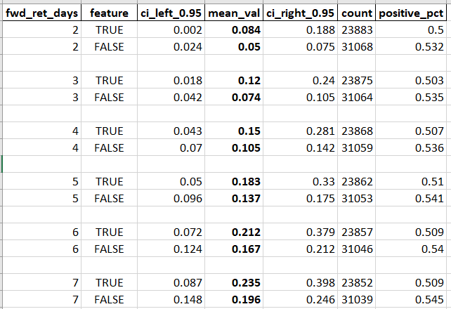

# python-backtesting-template
This repository allows to simplify and enhance testing of the trading signals you develop. While it leverages a popular Python `backtesting` plugin, it offers significantly more features.

Suggested Workflow:
1. **Statistical Testing**. Start with a quick test of your trading signal using the `run_fwd_return_analysis.py` file as a reference.
2. **Backtesting**. If the statistical test yields promising results, prepare and execute a backtest using the `run_strategy_main_simple.py` file as a guide.
3. **Strategy Optimization**. Optimize your trading strategy parameters, such as the maximum trade duration, profit target, stop loss, etc. Refer to the `run_strategy_main_optimize.py` file for instructions on how to do it.


# Understanding the Benefits of This Repo

Just like with the original Python `backtesting` package, you can obtain and use `stats`, `trades`, and interactive charts in HTML files. In addition, this repository solves many problems that the `backtesting` library does not solve.

1. You can easily run backtests of your strategy for several (or several dozen) tickers simultaneously. The results of these backtests are combined and saved in the `output.xlsx` file. For details, explore files in the `strategy` folder.

2. The `run_backtest_for_ticker` function returns not only `stats` and `trades` but also `last_day_result` dict. It allows you to send notifications if the trading signal is detected. For details, see the `utils/strategy_exec/last_day.py` file and `next` function.

3. The system updates trailing stop-loss daily using the Average True Range (ATR) multiplied by 2.5. If a volatility outbreak (`tr_delta` high value) is detected, the stop loss is tightened. You can customize this behavior in `utils/strategy_exec/sl_pt.py` file.

4. If it's possible to close half of the active position and make the remaining half risk-free, the system will do so. See the file `utils/strategy_exec/partial_close.py` for details. You can easily change or disable this behavior if you wish.

5. In addition to partial closures, the system handles many other special situations. For details, see the `utils/strategy_exec/special_situations.py` file. You are encouraged to modify the list of special situations, change the order of their processing, and add your custom special situations.

6. You can set the maximum duration for long and/or short trades. See the `process_max_duration` function for details.

7. You can set the profit target in percent for long and/or short trades. See the functions `check_set_profit_targets_long_trades` and `check_set_profit_targets_short_trades` for details.

8. You can analyze trades in many different ways. The system adds tags to many trades that explain their fate. Each trade can contain several tags. For details, explore the `add_tag_to_trades_and_close_position` function code and where it is called. See also the functions `add_feature_to_trades` and `get_stat_and_trades_for_ticker`. 

9. You can quickly test your hypotheses before setting up and running advanced backtests. For detailed instructions on this, see below. The file `run_fwd_return_analysis.py` provides a working example.

10. You can easily optimize every parameter of your trading strategy, including stop-losses, profit targets, maximum trade duration, and more. For detailed instructions on this, see below. The file `run_strategy_main_optimize.py` provides a working example. 

You create value by developing trading signals and rules for calculating the desired position size. This repository allows you to focus on these tasks while minimizing the time and effort spent on miscellaneous concomitant problems. 

Although everything written below may seem complicated, you will quickly understand it after reviewing the examples in the specified folders and files.

# Suggested Workflow

Let's assume you have a trading signal in mind and want to test whether it is worthwhile for real-world trading.

First, you create the necessary *derived columns* and one or more *features* based on them. Derived columns might include metrics such as trend slope, moving average, average true range (ATR), RSI, and others. Examples of functions that generate derived columns are available in the `/derivative_columns/` folder. For an example of a function that creates a Boolean feature column, refer to the `/features/f_v1_basic.py` file.

The next step is to run a quick analysis to see how returns in the following days relate to today's values of your features. The file `run_fwd_return_analysis.py` shows how to do it, with detailed explanations in this document below and in the code. 

If your feature is continuous, you can split it into groups and run the `analyze_values_by_group` function. This step is optional. The function `get_ma_200_relation_label` is an example of partitioning into groups and assigning labels to groups.

Also, you could regress the future returns on your continuous feature, though there isn’t an example of such a regression in the `run_fwd_return_analysis.py` file yet.

In most cases, statistical tests will reveal that your trading signals are not viable for practical use, particularly when factoring in brokerage commissions and spreads. 


If the preliminary analysis suggests that your trading signal warrants further testing, you can set up backtests.

It includes the following steps:

1. Review the code of the `next` function and other content of the `\strategy\run_backtest_for_ticker.py` file. Check out the input parameters of the `Backtest` class initialization.

2. List the parameters your trading strategy will require within the `StrategyParams` class. 

3. Define the rules for calculating the desired position size and code them within the `get_desired_current_position_size` function.

4. Review the code of the `process_special_situations` function. You might want to comment out certain special situations, add your own, or change the order in which the system processes them.

5. Review the code of the `update_stop_losses` function. Note the `stop_loss_default_atr_multiplier` parameter and its value. You may want to change the `update_stop_losses` function or cancel its daily calls inside the strategy's `next` function.

6. See the `process_partial_close` function. You may try to cancel its daily calls or change the `portion_to_close=0.5` value to, say, 0.33.

After completing the steps above, run backtests on the tickers you are interested in. Use the `run_strategy_main_simple.py` file as a template. 

Once you've conducted the backtests and reviewed the `output.xlsx` file, attempt to optimize your strategy parameters. The code and explanations in the `run_strategy_main_optimize.py` file will assist you in this process.

Please note that the file `output.xlsx` is created only if the number of tickers is more than one.

# Preliminary Analysis Before Running Backtests

The first step is implementing your trading signal as a **feature**—a Boolean column indicating whether one or more conditions are met on a given day. You can design these conditions using **derived columns** such as moving averages, average true range, and similar metrics. For examples, refer to the `/features/f_v1_basic.py` file and `/derivative_columns/` folder.

Before running backtests, start with a quick statistical test to evaluate how significantly the returns differ in subsequent days after the feature value is `True` and `False`. If the differences in returns are minimal, skip preparing and running the backtests.

Sometimes, the returns after `True` and `False` days differ significantly but in the opposite direction of what you expected. For example, a trading signal you intended to use for long positions might work better for entering short trades or vice versa.

**Warning**: Evaluating the test results requires a deep understanding of statistics.

This repository employs **bootstrapping** instead of traditional parametric methods, such as Student's t-test. The `get_bootstrapped_mean_ci` function handles the core calculations. If you are not familiar with bootstrapping, take some time to learn about it before diving into the function's code.

The file `run_fwd_return_analysis.py` provides a comprehensive working example of the preliminary analysis. You will find a detailed explanation of its code in the "A Real-Life Example" section below.

# How Backtests Run

Like the original `backtesting` package, most work happens within the `next` function of the `Strategy` you create. The system calls this function each day of your OHLC data, starting from the first day. 

Here’s what happens inside this function in the `run_backtest_for_ticker.py` file:
1. Update the trailing stop-losses for all open trades.
2. If we have open trades, check for special situations. (See more details on special situations in the following section.)
3. If no special situations are found, calculate the desired position size. If it differs significantly from the current size, buy or sell shares.
4. If today is the last day in the data, the system calls the `create_last_day_results` function, which populates and returns the `last_day_result` dictionary.

## Calculating Desired Position Size and Processing Results

The system calls the `get_desired_current_position_size` function to determine the current and desired position sizes. 

If the resulting desired position size is 0, the system closes all open trades. 

If it is `None`, no buy or sell orders are placed with the broker.

Otherwise, the system calculates the difference between the current and desired position size. If this difference is too large, an order is created to buy or sell the corresponding number of shares.

## Tracking Real-Time Trading Signals in Data

After the finish of the backtest, the `get_stat_and_trades_for_ticker` function returns the `last_day_result` dictionary together with other results. This dictionary is then passed to the `process_last_day_res` function. This function is intended to send you notifications when specific conditions are met. However, it has not been implemented yet. 

It is assumed that you will not change the code of the `next` function. The main goal of this repository is to free you from the effort of writing and modifying it. Instead, you can focus on coding the rules for determining the desired position size in the `get_desired_current_position_size` function.

# External Data Providers

The system currently uses [Alpha Vantage](https://www.alphavantage.co/) as its main source of OHLC data. If you encounter issues with this provider, you can switch to Yahoo Finance instead. 

Please see internals of the functions `import_alpha_vantage_daily` and `import_yahoo_daily`. One of these functions must be passed as `import_ohlc_func parameter` when creating an instance of the `TickersData` class. By default, `import_alpha_vantage_daily` is passed.

To use Alpha Vantage, register on their website to get a free API key, and save it in the `.env` file as `alpha_vantage_key=MY_A_V_API_KEY`. In the `\utils\import_data.py` file, there’s a line `ALPHA_VANTAGE_API_KEY = os.environ.get("alpha_vantage_key")`. Ensure that your code properly retrieves the API key from the `.env` file.

No API key is required for requests to Yahoo Finance. However, this provider only supplies daily OHLC data covering the last few years. Alpha Vantage, on the other hand, provides data over a longer historical period.

# Local Data Caching with Excel Files

The system saves local copies of data in Excel files. It stores “raw” data and also data with added *derived columns* and *features*. 

Template for naming a file with raw data: `single_raw_TICKER.xlsx`. Template for naming a file with data and added columns: `single_with_features_TICKER.xlsx`. 

All these files are stored in the `\tmp\` folder by default. You can easily change the destination folder and naming templates in the `constants.py` file.


The class `TickersData` carries the work with Excel cache files. This class is described in detail below.

# Centralized OHLC Data Repository

The `TickersData` class performs the following tasks:
1. It retrieves "raw" daily OHLC data for each ticker from an external provider.
2. It calls the `add_feature_cols_func` function to add *derived columns* and *features*.
3. It generates and stores a dictionary with tickers as keys and Pandas DataFrames as values.
4. It saves local Excel cache files, as described above.

If the class instance finds existing local `.xlsx` cache files, it reads that data instead of making requests to the external provider. If you want it to retrieve fresh OHLC data from the provider, delete the `single_raw_TICKER.xlsx` cache files manually.

An instance of the `TickersData` class acts as a centralized repository for OHLC data. All functions that require OHLC data use this instance to operate. 

For example,

``` python
def run_all_tickers(
    tickers_data: TickersData,
    strategy_params: StrategyParams,
    tickers: List[str] = tickers_all,
) -> float:
```

The class includes a `get_data` function that returns a ticker's DataFrame. It contains OHLC data, derived columns, and features. Take a couple of minutes to examine its code. 

See also `run_strategy_main_simple.py` file for how to instantiate the `TickersData` class.

## Optimizing Input Parameters for Feature Creation Functions

Your function for creating derived columns and features will likely have some input parameters. You may want to optimize them. The `run_strategy_main_optimize.py` file demonstrates how to do it.

First, use `functools.partial` as demonstrated in the file. Then, when creating an instance of the `TickersData` class, be sure to set `recreate_features_every_time=True`. If you don't, the code will read data from the `single_with_features_TICKER.xlsx` cache files instead of calling your function with a new set of parameters.

# Output.xlsx File Overview and Explanations

The `run_all_tickers` function creates and saves the `output.xlsx` file at the end of its execution. However, this only occurs if the number of tickers exceeds one.

Your `output.xlsx`file may look like the following:


If you are a trader, you probably understand the meaning of its rows. The only row that requires explanation is `SQN_modified`. 

System Quality Number (SQN) is a popular indicator of the trading system's quality developed by Dr. Van Tharp. Its classic formula has a drawback: it tends to produce overly optimistic results when analyzing more than 100 trades, particularly when the number of trades exceeds 150-200. 

`SQN_modified` is devoid of this drawback. It is simply the average of trade profits divided by the standard deviation of profits. A trading system is considered not bad if its `SQN_modified` has a positive value of at least 0.1. Systems whose `SQN_modified` value exceeds 0.2 are deemed decent or even good. 

By looking through the `output.xlsx` file, you can easily calculate the average `SQN_modified` for all tickers. Or simply use the result that the `run_all_tickers` function returns.

# Managing Special Situations

Special situations include scenarios such as the maximum trade duration expiring, a volatility spike occurring, or the discovery of a bullish or bearish candle. If the system detects at least one of these situations, it should close the position immediately.

You can access the most recent trade using this code: `last_trade = strategy.closed_trades[-1]`. Each trade has a `tag` parameter. When the system detects a special situation, it adds a tag to all trades before closing them, allowing you to identify the context later. The `add_tag_to_trades_and_close_position` function handles this task. For examples of its use, refer to the `utils/strategy_exec/special_situations.py` file.

You can parse the tag of the last trade and take different actions based on its content. For example, when some special situation is detected, it may be wise to wait a few days before opening new long or short positions.

You can specify which special situations to check and their order within the `process_special_situations` function. Additionally, you can add your custom special situations to the `utils/strategy_exec/special_situations.py` file. The profitability of trades largely depends on the rules you establish for handling special situations.

## Understanding the Partial Close Special Situation

The Partial Close Special Situation occurs when there is an opportunity to close part of a position—such as half or one-third—at a profit. It allows you to make the remaining portion of the position risk-free. The system processes the Partial Close special situation alongside other special situations. However, when it occurs, the position is only partially closed, not completely closed.

Handling the Partial Close special situation is a powerful strategy for enhancing the profitability of your trading systems. You can turn it off within the `process_special_situations` function code, but it is almost always advisable to leave it enabled.

Take the time to study the `process_partial_close` and `_process_partial_close` functions closely. In the line `_, size_to_close = math.modf(abs(strategy.position.size) / 2)`, you can specify the percentage of the position to close. By default, it is set to close half of the position. You can try to adjust it to one-third instead.

# Optimization of Strategy Parameters

The `StrategyParams` class should contain all the parameters of your trading strategy. All essential functions have access to these parameters, including:
- `get_desired_current_position_size` 
- `process_special_situations`
- `update_stop_losses`
- function that created derived columns and features

First, successfully run backtests for your set of tickers using one set of parameters. The `run_strategy_main_simple.py` file will assist you with this. Afterward, you can optimize the parameters of your trading strategy. The `run_strategy_main_optimize.py` file should help you with this. After it runs, you'll have a file `optimization_results.xlsx` with the results. It will look like this.


It's a good sign when the charts of backtest results depending on parameter values resemble Gaussian curves. Little deviations from the optimal parameter values should ​​only cause slight deterioration in backtest results. If the backtest results fluctuate wildly and chaotically, something went wrong.

# A Real-Life Example

This repository contains a real-world study of the 200-day simple moving average (`ma_200`). 

There are two common opinions among traders: 

- Nothing good ever happens below the 200-day moving average.

- Buy the dip!

They can't both be true. Let's establish the truth. 

The study utilized daily OHLC data from twelve popular ETFs listed in the `tickers_all` list. These ETFs include stocks, precious metals, and commodities.

## Preliminary Analysis

The file `features/f_v1_basic.py` contains a function called `add_features_v1_basic` intended to serve as an example and source of inspiration. 

The feature evaluates to `True` if today's closing price is below the 200-day simple moving average.

``` python
res[FEATURE_COL_NAME_BASIC] = res["Close"] < res[f"ma_{MOVING_AVERAGE_N}"]

``` 

Also, we create one more "advanced" feature there. It evaluates to `True` only if today's closing price is *significantly* lower than the 200-day moving average.

``` python
    res[FEATURE_COL_NAME_ADVANCED] = (res["ma_200"] - res["Close"]) >= (
        res["atr_14"] * atr_multiplier_threshold
    )
``` 

To create these features, we need the following derived columns: average true range and 200-day moving average. If the DataFrame lacks these columns, the system must call the functions that add them.

``` python
MOVING_AVERAGE_N = 200
REQUIRED_DERIVATIVE_COLUMNS_F_V1_BASIC = {"atr_14", f"ma_{MOVING_AVERAGE_N}"}

def add_required_cols_for_f_v1_basic(df: pd.DataFrame) -> pd.DataFrame:
    """
    Ensure that every column listed in REQUIRED_DERIVATIVE_COLUMNS_F_V1_BASIC is present in the DF
    """
    df_columns = df.columns
    internal_df = df.copy()
    if f"ma_{MOVING_AVERAGE_N}" not in df_columns:
        internal_df = add_moving_average(df=internal_df, n=MOVING_AVERAGE_N)
    if "atr_14" not in df_columns:
        if "tr" in df_columns:
            internal_df["atr_14"] = internal_df["tr"].rolling(14).mean()
        else:
            internal_df = add_atr_col_to_df(df=internal_df, n=14, exponential=False)
    return internal_df
``` 

A slightly more advanced preliminary analysis was also conducted. This approach involved splitting each ticker's data into several discrete groups based on the distance between the closing price and the 200-day moving average. After that, for each group, you can calculate and compare average returns over the next few days.

The `get_ma_200_relation_label` function was used to categorize data into groups. The distance between the closing price and the 200-day moving average is measured using 14-day Average True Range (`atr_14`). For example:

``` python
if (row["Close"] - row["ma_200"]) >= (row["atr_14"] * 6):
    return "HIGHLY_ABOVE"
``` 

The data were divided into the following groups:
- HIGHLY_ABOVE
- MODERATELY_ABOVE
- SLIGHTLY_ABOVE
- SLIGHTLY_BELOW
- MODERATELY_BELOW
- HIGHLY_BELOW

For details, see the `get_ma_200_relation_label` function code.

The following paragraphs provide an explanation of how the code in the `run_fwd_return_analysis.py` file operates.

First, create an instance of the `TickersData` class, as detailed above. This instance will act as a data source for all following operations.

``` python
tickers_data = TickersData(
    tickers=tickers_all,
    add_feature_cols_func=add_features_v1_basic,
)
``` 

Let's say today the feature value is `True`. We want to assess:

1. The strength of its influence on returns in the following days.
2. The duration of the effect. 

To do this, we sequentially run checks for different periods (e.g., 1 day, 2 days, 3 days, etc.). After that, the system generates a DataFrame containing all the gathered data.

``` python
    res: List[dict] = list()
    FWD_RETURN_DAYS_MAX = 16
    for fwd_return_days in range(2, FWD_RETURN_DAYS_MAX + 1):
        print(
            f"Now check for fwd returns {fwd_return_days} days - up to {FWD_RETURN_DAYS_MAX}"
        )
        res = _check_feature_for_fwd_ret_days(
            tickers_data=tickers_data_instance,
            res_to_return=res,
            fwd_ret_days=fwd_return_days,
            insert_empty_row=True,
            feature_col_name=FEATURE_COL_NAME_BASIC,
        )
    df = pd.DataFrame(res)
``` 

The `_check_feature_for_fwd_ret_days` function includes detailed comments within its code.

Result:



It is now clear that the idea that nothing good ever happens below the 200-day moving average is a misconception. However, the data we've gathered isn't sufficient to identify the conditions under which buying the dip is advisable. Would analyzing the data split into groups help with it?

``` python 
    # NOTE This is for convenient sorting of rows
    # in the resulting Excel file.
    group_order_ma_200_rel = {
        "HIGHLY_ABOVE": 1,
        "MODERATELY_ABOVE": 2,
        "SLIGHTLY_ABOVE": 3,
        "SLIGHTLY_BELOW": 4,
        "MODERATELY_BELOW": 5,
        "HIGHLY_BELOW": 6,
        "all_data": 7,  # all_data row is important, don't miss it
    }

    analyze_values_by_group(
        df=combined_ohlc_all,
        group_col_name=GROUP_COL_NAME,
        values_col_name="fwd_ret_4",
        group_order_map=group_order_ma_200_rel,
        excel_file_name=EXCEL_FILE_NAME_BY_GROUP,
    )
```

Result:


The average returns in the HIGHLY_BELOW group were significantly higher than in all other groups. This result is quite robust, as the analysis utilized data from a diverse set of ETFs. Running backtests of the HIGHLY_BELOW group as a signal for taking long positions seems worthwhile.

## Running Backtests with One Set of Parameter Values

First of all, you need to create the corresponding feature as described above.

``` python 
    def add_features_v1_basic(
        df: pd.DataFrame, atr_multiplier_threshold: int = 6
    ) -> pd.DataFrame:
    
    ...

    # feature_advanced is a HIGHLY_BELOW group of the get_ma_200_relation_label function.
    res[FEATURE_COL_NAME_ADVANCED] = (res["ma_200"] - res["Close"]) >= (
        res["atr_14"] * atr_multiplier_threshold
    )
```

The ATR multiplier could be set as a fixed value. Instead, we're being more flexible by passing it as the `atr_multiplier_threshold` input parameter. It allows us to optimize its value later, along with other parameters in the trading strategy.

After creating a feature, define the rules for calculating the desired position size within the `get_desired_current_position_size` function. 

If the current position is zero and `feature_advanced` is `True`, enter a 100% long position.

``` python 
    desired_position_size: Optional[float] = None

    if current_position_size != 0:
        desired_position_size = current_position_size
        return desired_position_size, current_position_size, DPS_STUB
    
    if strategy._data[FEATURE_COL_NAME_ADVANCED][-1] == True:
    desired_position_size = 1.0
    # otherwise, it remains None, i.e. signal do nothing

    return desired_position_size, current_position_size, DPS_STUB
```

At this stage, you should verify and adjust the handling of special situations, including partial closing of the position and stop-losses. In the tutorial example, we skip these adjustments, leaving the default settings in place. Let's explain, edit, and run the code in the `run_strategy_main_simple.py` file. 

First of all, list all parameters of your trading strategy in the `StrategyParams` class and create an instance of that class.

``` python 
    strategy_params = StrategyParams(
        max_trade_duration_long=8,
        max_trade_duration_short=100,
        profit_target_long_pct=5.5,
        profit_target_short_pct=17.999,
        save_all_trades_in_xlsx=False,
    )

    # NOTE.
    # In the educational example, we take only long positions,
    # so max_trade_duration_short and profit_target_short_pct parameters
    # are not meaningful.

```

To proceed, create an instance of the `TickersData` class, just as you did in the preliminary analysis. When the system runs the `__init__` function of this class, the console will display the source of the OHLC data—whether it’s retrieved from local Excel cache files or requested from external providers.

To complete the setup, call the `run_all_tickers` function, providing it with the newly created objects `strategy_params` and `tickers_data` as input parameters.

``` python 
    SQN_modified_mean = run_all_tickers(
        tickers_data=tickers_data,
        tickers=tickers_all,
        strategy_params=strategy_params,
    )
    logging.debug(f"{SQN_modified_mean=}")
```

If the code executes smoothly, it will create the `output.xlsx` file, allowing you to review its contents.

## Optimizing Parameter Values

In this simplified tutorial example, we take only long trades, so we have just a few key parameters to optimize:

- Maximum duration of long trades `max_trade_duration_long`

- Profit target for long trades (expressed in percentages) `profit_target_long_pct`

- Average True Range (ATR, `atr_14`) multiplier `atr_multiplier_threshold`

Be particularly mindful of the `atr_multiplier_threshold` parameter. This parameter serves as an input for the function that generates derived columns and features. Unlike other parameters, it is not present among the fields of the `StrategyParams` class. It requires special handling, which is outlined below.

Now, let’s examine the `run_strategy_main_optimize.py` file. In this file, the creation of instances for the `StrategyParams` and `TickersData` classes, along with the execution of the `run_all_tickers` function, has been moved to a standalone function, `run_all_tickers_with_parameters`. This function accepts the strategy parameter values as inputs and returns `SQN_modified_mean`.

## Feature Creation Optimization: Fine-Tuning Parameters

You’ll create a function to add derived columns and features to your data. Its recommended location is in the `\features\` folder. In the example provided, this function is called `add_features_v1_basic`. It has one input parameter, `atr_multiplier_threshold`. Your custom function will likely have one or more input parameters as well. You may want to optimize them for the best results.

When creating a `TickersData` instance, the system calls a function to add features. You specify this function through the `add_feature_cols_func` parameter. However, you can’t directly pass input parameter values. The solution is to use `functools.partial`, as shown in the example below.

``` python 
    # make add_features_v1_basic function
    # use the atr_multiplier_threshold input
    # instead of default value
    p_add_features_v1 = partial(
        add_features_v1_basic, atr_multiplier_threshold=atr_multiplier_threshold
    )
    tickers_data = TickersData(
        add_feature_cols_func=p_add_features_v1,
        tickers=tickers_all,     
        recreate_features_every_time=True
        # NOTE If recreate_features_every_time=False,
        # atr_multiplier_threshold optimization won't work
    )
```

The `recreate_features_every_time` parameter deserves close attention. By default, its value is `False`.

The system stores cached data, including derived columns and features, in Excel files in the `\tmp\` folder.


If you don’t set `recreate_features_every_time` to `True`, the system will load data from these files rather than calling the feature-creation function each time. As a result, optimizing the input parameters of the feature-creation function won’t be effective.

## Finding Optimal Parameter Values Through Trial and Error

In the main section of the file, start by defining the parameter value ranges you'd like to test.

``` python 
# Here you list the parameters you want to optimize, as well as their value ranges.
# These same parameters must be used
# when calling the run_all_tickers_with_parameters() function.
max_trade_duration_long_vals = range(9, 11)
profit_target_long_pct_vals = [x / 10.0 for x in range(25, 45, 10)]
atr_multiplier_threshold_vals = range(6, 8)

combinations = itertools.product(
    max_trade_duration_long_vals,
    profit_target_long_pct_vals,
    atr_multiplier_threshold_vals,
)
total_count = sum(1 for x in combinations)

# NOTE this reload is mandatory,
# because the iterator was consumed
# when determined the total_count
combinations = itertools.product(
    max_trade_duration_long_vals,
    profit_target_long_pct_vals,
    atr_multiplier_threshold_vals,
)
```

Next, execute `run_all_tickers_with_parameters` for each combination of parameter values, storing the results after each run.

``` python 
counter = 0
for item in combinations:
    counter = counter + 1
    print(f"Running combination {counter} of {total_count}...")
    max_trade_duration_long = item[0]
    profit_target_long_pct = item[1]
    atr_multiplier_threshold = item[2]
    SQN_modified_mean = run_all_tickers_with_parameters(
        max_trade_duration_long=max_trade_duration_long,
        profit_target_long_pct=profit_target_long_pct,
        atr_multiplier_threshold=atr_multiplier_threshold,
        save_all_trades_in_xlsx=False,
    )
    result = {
        "max_duration_long": max_trade_duration_long,
        "profit_tgt_lg_pct": profit_target_long_pct,
        "atr_multiplier": atr_multiplier_threshold,
        "SQN_m_mean": SQN_modified_mean,
    }
    all_results.append(result)
    # save to Excel file every time in case the script execution is interrupted.
    # The next time you run it, you won't have to process the same parameter sets again.
    pd.DataFrame.from_records(all_results).to_excel(EXCEL_FILE_NAME, index=False)
```

Result:


All `SQN_modified_mean` values are negative, indicating that the average trade profitability is below zero once broker commissions and spreads are accounted for. It isn’t unexpected, as the trading signal relies on a simplified feature. In real-world trading, achieving profitability requires a more advanced approach.

# Conclusion

This repository contains a substantial amount of Python code. Unfortunately, its structure is quite complex. Due to limitations in the original `backtesting` package, simplifying it isn't feasible. Learning the available features and understanding the code's intricacies will take time and effort, but I believe it will be a worthwhile investment for you.

You can follow me on [Twitter](https://x.com/kust1983) and connect with me on [LinkedIn](https://www.linkedin.com/in/kushchenko/).

See also my repo devoted to [Anchored VWAPS](https://github.com/s-kust/anchored_vwaps).

# Changelog

*22.12.2024.*

1. In the `run_fwd_return_analysis.py` file, the testing is now performed not for a single number of days, but for a specified range.
2. The OHLC data must include the necessary *derived columns* to create *features*. Previously, the `TickersData` class handled it, but now this responsibility has been shifted to the functions that generate features. If a function cannot find the required derived columns, it should call other functions to add them. For an example, refer to the `/features/f_v1_basic.py` file.
3. The long and bulky function `get_df_with_features` has been split into several smaller functions.

